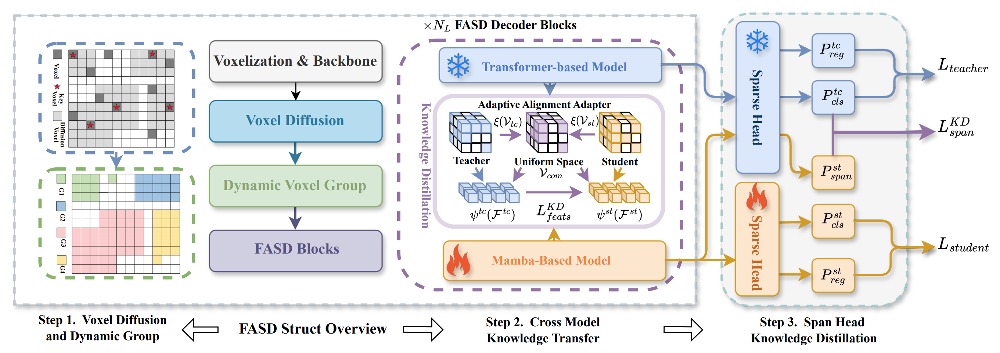

<h1>FASD</h1>
<h3>
Unleashing the Potential of Mamba: Boosting a LiDAR 3D Sparse Detector by Using Cross-Model Knowledge Distillation</h3>
<strong>Accepted to RAL</strong>

[Rui Yu](https://github.com/YuruiAI)1, [Runkai Zhao](https://scholar.google.com/citations?user=JvoODTgAAAAJ&hl=zh-CN)2, [Jiagen Li](https://scholar.google.com/citations?hl=zh-CN&user=_ZKWq1AAAAAJ)1, [Qingsong Zhao](https://scholar.google.com/citations?hl=zh-CN&user=ux-dlywAAAAJ)3, [Huaicheng Yan](https://scholar.google.com/citations?user=FDNcY_MAAAAJ&hl=zh-CN)1, [Meng Wang](https://scholar.google.com/citations?user=_abJw5cAAAAJ&hl=zh-CN)1, 

1 East China University of Science and Technology， 2 The University of Sydney, 3 Fudan University

&nbsp;
&nbsp;

## News
<!-- * **`24 , 2025`:** We reorganize code for better readability. Code & Models are released. -->
<!-- * **`Sep. 7th, 2025`:** We reorganize code for better readability. Code & Models are released. -->
* **`Aug. 31, 2025`:** We release the FASD paper on [arXiv](https://arxiv.org/pdf/2409.11018?). 
* **`Aug. 08, 2026`:** FASD is accepted to RAL!
* **`AUG. 20, 2026`:** FASD is published at RAL on IEEE Open Access [Paper](https://ieeexplore.ieee.org/document/11662378).
